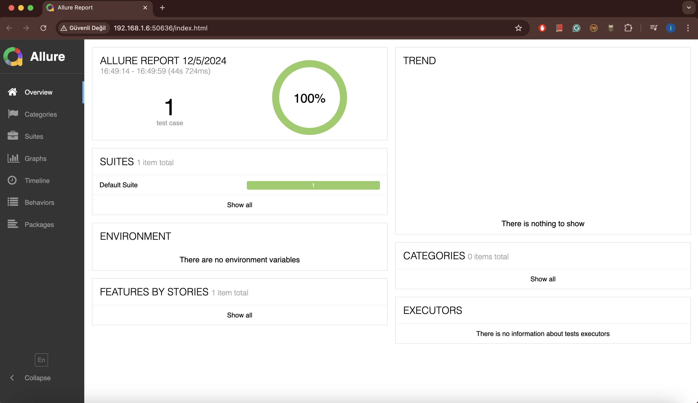

# iyzico-web-ui-automation

This project is a web UI automation framework for testing user interfaces, built using Selenium, Cucumber, and TestNG, with Maven as the build tool. It is designed to test web applications efficiently and generate detailed reports using Allure.

---

## Table of Contents

1. [Project Overview](#project-overview)
2. [Technologies Used](#technologies-used)
3. [Setup Instructions](#setup-instructions)
4. [Project Structure](#project-structure)
5. [How to Run Tests](#how-to-run-tests)
    - [Run All Tests](#run-all-tests)
    - [Run Tagged Scenarios](#run-tagged-scenarios)
6. [Allure Reporting](#allure-reporting)
7. [Example Allure Report](#example-allure-report)
8. [FAQ](#faq)

---

## Project Overview

The `iyzico-web-ui-automation` framework is a scalable solution for automating UI tests for web applications. It leverages:
- **Selenium** for browser interactions.
- **Cucumber** for behavior-driven development (BDD) and scenario writing.
- **TestNG** for test execution and parallelization.
- **Allure** for generating interactive and visually appealing reports.

---

## Technologies Used

- **Java 11**: Programming language for automation scripts.
- **Selenium WebDriver**: Browser automation tool.
- **Cucumber**: BDD framework for writing tests in plain language.
- **TestNG**: Testing framework for managing test execution.
- **Maven**: Build tool for managing dependencies and running tests.
- **Allure**: Reporting tool for generating detailed test reports.

---

## Setup Instructions

### Prerequisites
1. Install Java 11 and set the `JAVA_HOME` environment variable.
2. Install Maven (version 3.x or higher).
3. Install Allure (refer to the [official Allure installation guide](https://docs.qameta.io/allure/)).
4. Clone this repository to your local machine.

### Install Dependencies
Navigate to the project directory and run:
```bash
mvn clean install
```

This will download all the required dependencies and compile the project.

---

## Project Structure

```
iyzico-web-ui-automation/
├── src/
│   ├── main/
│   │   └── java/             # Core business logic
│   ├── test/
│   │   ├── java/               # Step definitions, TestRunner class, and utility classes
│   │       ├── features/       # Cucumber feature files defining test scenarios
│   │       ├── pages/          # Page Object classes for UI element mappings and methods
│   │       ├── steps/          # Step definition classes linking feature file steps with code
│   │       ├── utils/          # Utility classes and helpers for test execution
│   │          ├── driver/      # WebDriver configuration and management
│   │          ├── helper/      # General-purpose helper methods
│   │             ├── elementHelper/       # Helpers specifically for UI elements
│   │                ├── Element           # Represents individual web elements
│   │                ├── ElementMap        # Maps elements to their locators
│   │                ├── ElementResponse   # Responses related to element actions
│   │             ├── helper/          # Additional helpers
│   │                ├── Action        # Handles browser and UI interactions (e.g., clicks)
│   │                ├── FileHelper    # Utility for file operations (e.g., reading/writing files)
│   │                ├── Helper        # General utilities for common tasks
│   │                ├── PropertyManager  # Manages configuration properties
│   │   ├── resources/
│   │       ├── driver/       # WebDriver binaries
│   │       ├── dao/          # Data access for test data
│   │       ├── elementValues/ # Page-specific element JSON files
│   │       ├── properties/   # Configuration files
│   │       └── testng.xml    # TestNG suite configuration
├── allure-results/           # Allure report results
├── target/                   # Compiled code and test output
├── pom.xml                   # Maven configuration file
└── README.md                 # Project documentation (this file)
```

---

## How to Run Tests

### Run All Tests
To run all test cases in the project, execute:
```bash
mvn clean test
```

### Run Tagged Scenarios
To execute specific tagged scenarios, use the following command:
```bash
mvn test -Dcucumber.filter.tags="@tagName"
```

Replace `@tagName` with the desired tag from your Cucumber feature files.

---

## Allure Reporting

### Generate and View Allure Reports
1. Run your tests using Maven. Test results will be stored in the `allure-results` directory.
2. Serve the Allure report locally by running:
   ```bash
   allure serve
   ```
3. This command will open the report in your default browser.

---

## Example Allure Report



---

## FAQ

### 1. Maven command fails with `NoClassDefFoundError`
Ensure all dependencies are properly installed by running:
   ```bash
   mvn clean install
   ```

### 2. WebDriver executable not found
Verify that the WebDriver binaries are located in `src/test/resources/driver` and the correct path is configured.

### 3. Allure command not recognized
Ensure Allure is installed and added to your system's PATH.

### 4. How to add a new tag to scenarios?
- Open the feature file in `src/test/resources/features/`.
- Add a tag (e.g., `@newTag`) above the desired scenario.